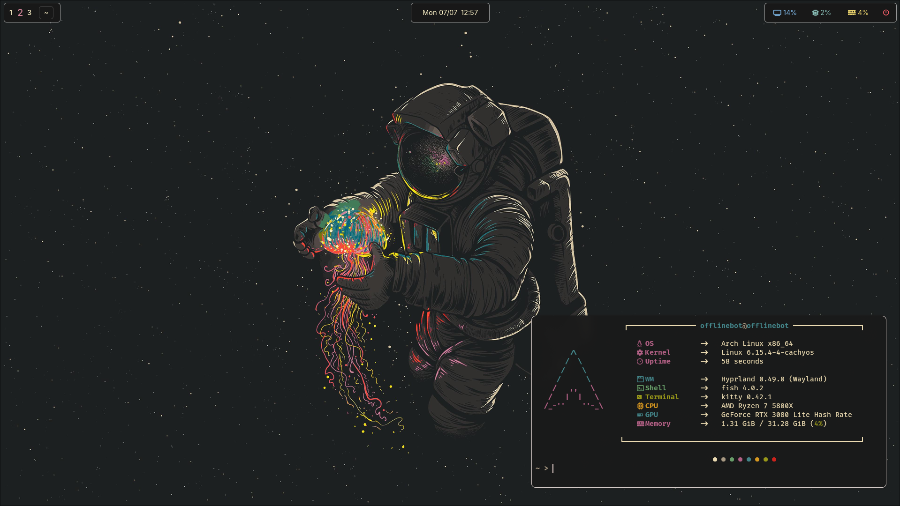
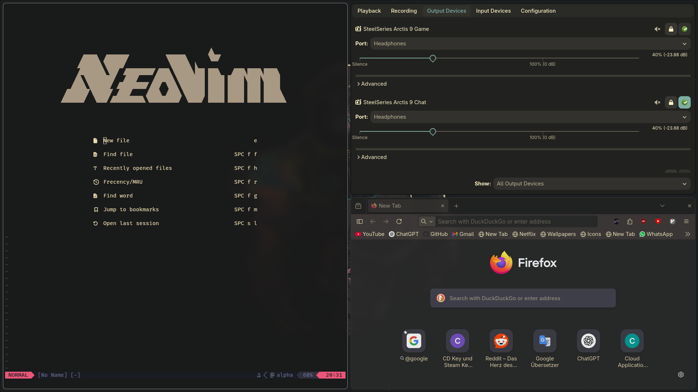

My personal Arch Linux setup

## Includes:
- dotfiles (config files) in .config
- gtk themes in .themes
- wallpaper in Picture/wallpaper
- overall current theme: Gruvbox

## Screenshots




## Setup:

Install basic requirements (using yadm here)

```sh
sudo pacman -S yadm git
```

Load the dotfiles

```sh
yadm clone https://github.com/OfflineBot/arch.git
```

## Additional Setup:

To setup my SDDM config put the content from `.etc` and `.usr` in its place. (`.etc/filename.txt` would be `/etc/filename.txt`).


